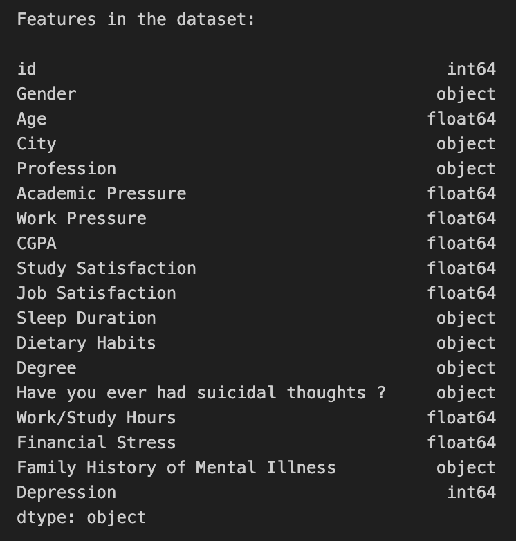
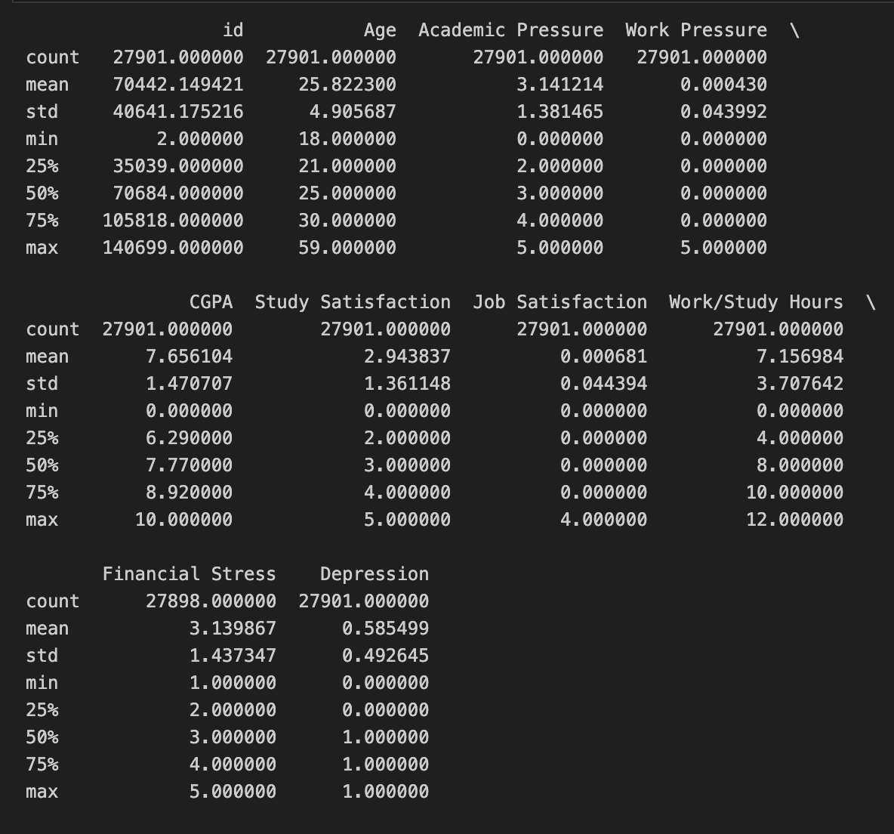
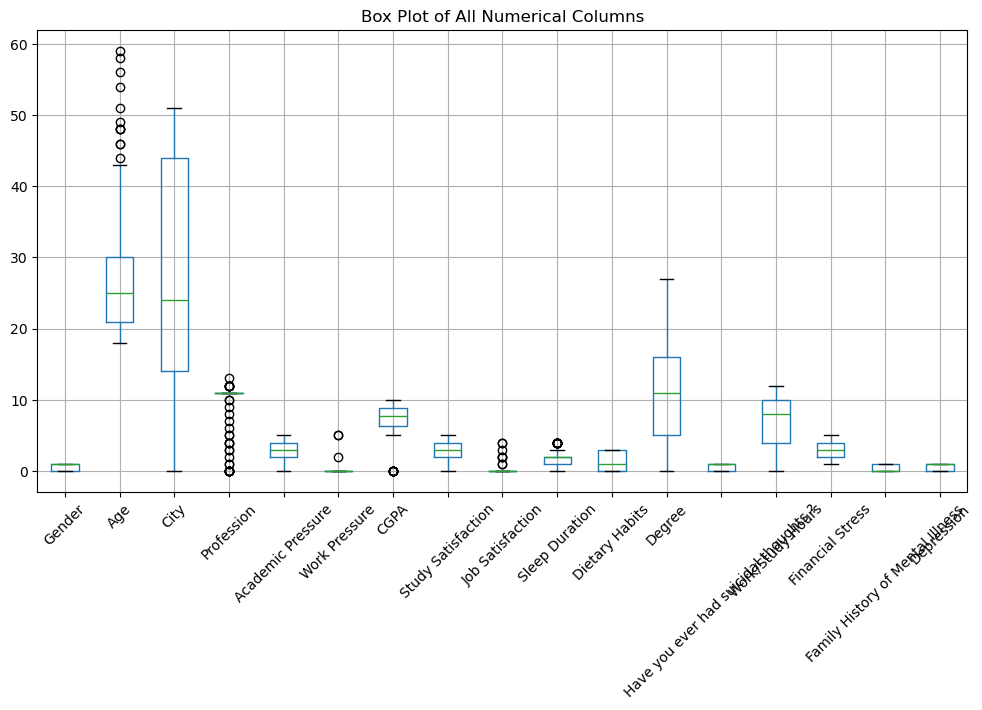
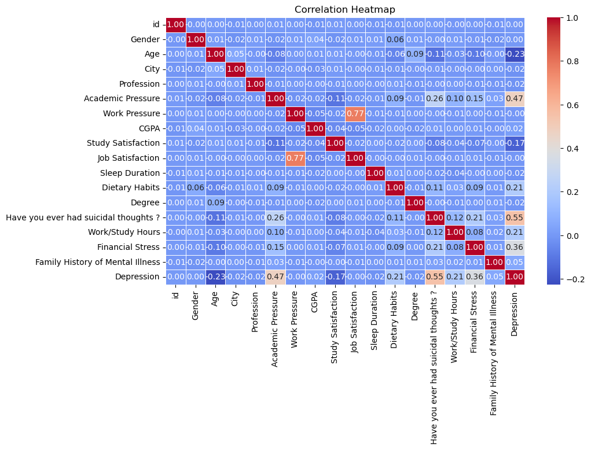
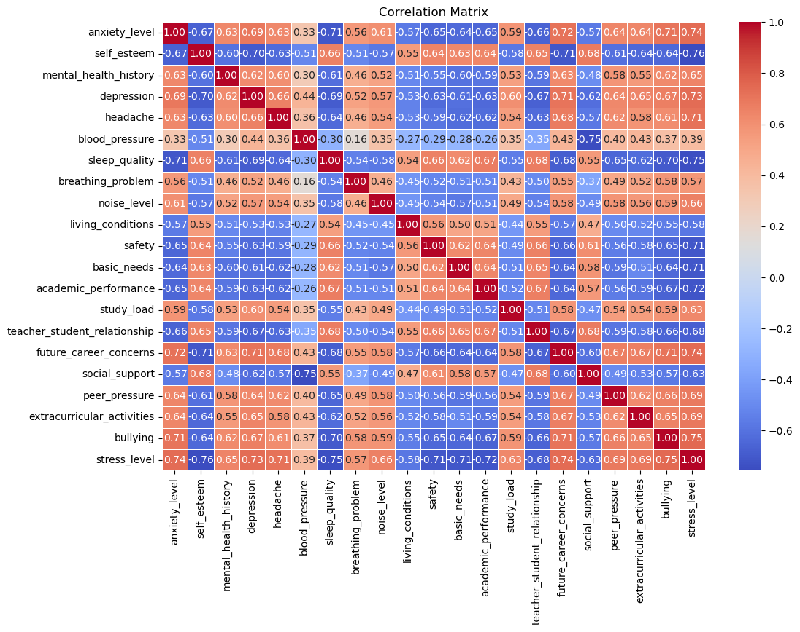

# Milestone 1 

## Problematic

## Datasetsand Exploratory Data Analysis

### [Mental disorders and music features](https://www.kaggle.com/datasets/chlobon/mental-disorders-and-music-features/data)

The mental disorder and music features dataset contains 649.244 rows. We then proceed to observe the data and find that some songs are the same but with Remastered or the year in the name, so we eliminate the suffixes to make them the same. We then proceeded to eliminate all the rows which had missing data(around a 10000), and were left with 526680 rows. We checked for duplicate rows but found none .We finally dropped columns that were relied on for formatting, and would be useless for our analysis. After this we were left with 526680 clean rows corresponding to a user, a song title, music characteristics  and the mental disorder of the user.

### [Music & Mental Health Survey Results](https://www.kaggle.com/datasets/catherinerasgaitis/mxmh-survey-results)

The Music & Mental Health Survey Results dataset consists of data about individuals' music taste and their self-reported mental health. It consists of 736 rows and 33 columns, where one row represents one person, and the columns are features related to their music taste and behaviour, as well as their self reported mental health. After removing all rows with missing data, we were left with 616 rows. We dropped the timestamp and permission columns as we don’t need this data. We end up with a dataset which consists of 616 rows and 31 columns.

### [Student Depression Dataset](https://www.kaggle.com/datasets/hopesb/student-depression-dataset?resource=download)

This dataset contains demographic statistics as well as mental health indicators and a depression diagnosis for about 28 thousand university students and 18 people with a profession other than “student”. The mean age of the dataset is about 25. 

### [Student Stress Factors: A Comprehensive Analysis](https://www.kaggle.com/datasets/rxnach/student-stress-factors-a-comprehensive-analysis/data)

This dataset contains 1100 rows where each row corresponds to a student survey reply with data with mental health indicators and lifestyle attributes in each column. The dataset requires very little preprocessing as it contains no null values as well as no duplicates. The values are straightforward as well, as they are mostly numerical, so anything besides normalizing is probably superfluous

We see, that the dataset has a lot of interesting features, which will (hopefully) help us find correlations between lifestyle and depression.

After running a linear regression on the normalized data, we see that we in fact have features with a greater weight than other, such as financial stress, and some features with negative weight, like age.

### Exploratory Data Analysis

When examining the factors of stress dataset, the box plots showed us how things like anxiety levels, self-esteem, and mental health history varied across the board. For instance, we noticed that mental health history and depression had a pretty wide range, meaning people had all sorts of different experiences.
When we looked at the correlation matrix, we saw some clear patterns. Like, anxiety and stress levels were tightly linked—when one went up, the other usually followed. On the flip side, self-esteem and depression had a negative connection; lower self-esteem often meant higher depression levels, which would make sense intuitively.

### Related work

