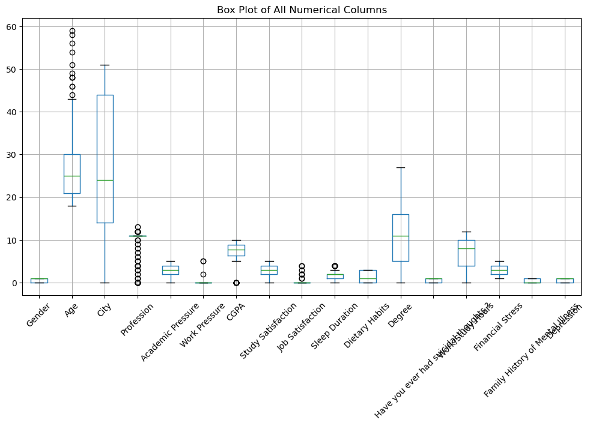
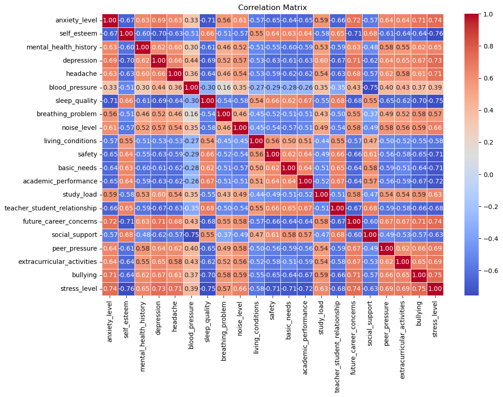

# Milestone 1 

## Problematic

It’s no secret that music can have profound impacts on a person’s mood and feelings. Music is frequently used in situations where a good mood is desired, like in bars, while dancing, while studying. And the inverse is true. What is a sad breakup without some music to accompany the process of getting over someone? This observation prompts us to ask the question, how are music and mental health correlated? Can you guess a person's self reported mental health if you know their music habits?

We want to  “visualize the invisible”. Having a look at the datasets however reveals, that the invisible is invisible in the datasets as well. Thus, instead of showing the connection between music and mental health, we will challenge the assumption that one exists. 

Our interactive visualization will invite users to guess a persona’s mental health based on their music preferences. By showing how difficult it is to make accurate guesses, we aim to highlight that music habits and mental health are not correlated, thus challening the preconcieved notion that they are. Following this, we will present data-driven visualizations of other factors that have been shown to correlate with mental health, encouraging users to rethink how well-being can (and cannot) be inferred from daily habits.

## Datasets and Exploratory Data Analysis

### [Mental disorders and music features](https://www.kaggle.com/datasets/chlobon/mental-disorders-and-music-features/data)

This dataset contains user and song pairs, each row representing a user listening to a song. Each entry in the dataset has a user ID, a song title, characteristics of the song and the mental disorder of the user. The data is quite dirty, containing duplicates and missing data. After cleaning, we are left with about 500.000 song, user pairs. 

We see, that the strongest correlations occur within the song characteristics and among the different mental health issues, however little correlation can be seen between mental health issues and music features.

### [Music & Mental Health Survey Results](https://www.kaggle.com/datasets/catherinerasgaitis/mxmh-survey-results)

The Music & Mental Health Survey Results dataset consists of data about individuals' music taste and their self-reported mental health. After cleaning, it contains about 600 rows. For each sample the dataset contains features related to  music taste and behaviour, as well as self reported mental health.

 When exploring the dataset Music & Mental Health Survey Results we found that some genres (like pop, rap, and rock) are more frequently listened to. Listeners with rock  or metal as their favourite genre seems overrepresented in the dataset. Most people use Spotify to stream.

 

 When examining mental health by favorite genre, we see that no single genre consistently reports exclusively high or low scores. This indicates that mental health experiences vary significantly within each listener group. 

 
 
 Once again, the correlation matrix confirms that the strongest correlations occur among the different self-reported mental health measures themselves and among the frequencies of listening to various genres, rather than between mental health and specific genre preferences.

 

### [Student Depression Dataset](https://www.kaggle.com/datasets/hopesb/student-depression-dataset?resource=download)

This dataset contains demographic statistics as well as mental health indicators and a depression diagnosis for about 28.000 university students and 18 people with a profession other than “student”. The mean age of the dataset is about 25. 

We see, that the dataset has a lot of interesting features, which will (hopefully) help us find correlations between lifestyle and depression.

After running a linear regression on the normalized data, we see that we in fact have features with a greater weight than other, such as financial stress, and some features with negative weight, like age.

### [Student Stress Factors: A Comprehensive Analysis](https://www.kaggle.com/datasets/rxnach/student-stress-factors-a-comprehensive-analysis/data)

This dataset contains 1100 rows where each row corresponds to a student survey reply with data with mental health indicators and lifestyle attributes in each column. The dataset requires very little preprocessing as it contains no null values as well as no duplicates. 

When examining the features of stress dataset, the box plots showed us how things like anxiety levels, self-esteem, and mental health history varied across the board. For instance, we noticed that mental health history and depression had a pretty wide range, meaning people had all sorts of different experiences.
When we looked at the correlation matrix, we saw some clear patterns. Like, anxiety and stress levels were tightly linked—when one went up, the other usually followed. On the flip side, self-esteem and depression had a negative connection; lower self-esteem often meant higher depression levels, which would make sense intuitively.

### Related work

Our datasets have been used in quite a few other data analysis projects online [1] [2] [3], however most of them don’t go further than simple presentations of statistics, and they generally don’t tell a thought-provoking story. In our project we will not be focussing on a rigorous scientific exploration of the data, but rather visualizing correlations in a fun and artistic way. We want to enhance storytelling by letting the users get their assumptions tested before being presented with the data. We aim for a data story which evokes emotions and thought, similar to audible and tactile installations in museums, like Esther Shalev-Gerz’s White Out – Between Telling and Listening, which can be found in Lausanne’s Cantonal Museum of Fine Arts (MCBA) [4]

[1]:  https://www.kaggle.com/datasets/catherinerasgaitis/mxmh-survey-results/code

[2]: https://www.kaggle.com/datasets/hopesb/student-depression-dataset/code

[3]: https://www.kaggle.com/datasets/rxnach/student-stress-factors-a-comprehensive-analysis/code

[4]: https://www.mcba.ch/en/collection/white-out-between-telling-and-listening-2/

